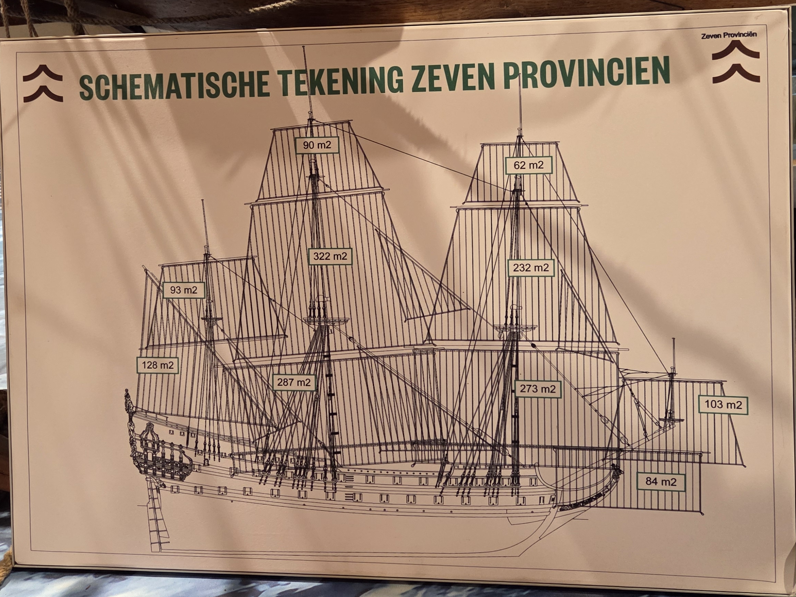

# Analysis of the Drawing: "Schematische Tekening Zeven Provinciën" (20250821_115101.jpg)
The provided image shows a schematic drawing (labeled "SCHEMATISCHE TEKENING ZEVEN PROVINCIËN") of the famous 17th-century Dutch ship-of-the-line, De Zeven Provinciën (The Seven Provinces). This ship was the flagship of Admiral Michiel de Ruyter during the Second and Third Anglo-Dutch Wars.

The goal of this project is to create an accurate 3D model of the ship using a **real-size scale (1:1)**, based on historical data.

The drawing specifically focuses on the sail plan and sail areas of the vessel. Here is a breakdown of the information presented:

## Summary of Design
The drawing illustrates a three-masted square-rigged ship, which was the standard for heavy warships of that era. The sail plan is designed for a balance of power (large main and fore sails) and maneuverability (the lateen mizzen sail at the rear). The total sail area shown here adds up to approximately 1,674 m², providing the immense force required to move a ship carrying 80 or more cannons.

# Drawing Plan

The model is built using curved Bezier-based geometry to match the historical schematic "SCHEMATISCHE TEKENING ZEVEN PROVINCIËN".

## Keel
The structural base of the ship, now modeled with a slight dip and curved transitions to match 17th-century hull designs.

## Sternpost
A curved heavy beam at the rear, raked backwards.

## Stempost (stem)
A curved heavy beam at the front, raked forwards and upwards to form the bow's profile.

## Hull Ribs (spanten)
Successfully modeled 15 primary hull ribs along the keel. These ribs define the ship's volumetric profile, with wider sections in the center and a gradual taper toward the bow and stern. They are constructed using Bezier curves to allow for smooth transitions and realistic hull curvature.

## Decks

## Masts

## Sails

## Stern

## Bow

## Rigging

## Anchoring

## Rudder

# Monitoring

For monitoring the ship's building process, we want to take regular snapshots of the drawing.
This is done by taking a photo of the drawing and labeling it with the date and time.
We will take a camera position and direction that captures the entire drawing in the frame, ensuring that all details are visible. The camera will be positioned at a fixed distance from the drawing to maintain consistency across all snapshots.
The images are then stored in a folder named "images" in the ship's folder.

# Image Processing

To process the images, we will use Python's OpenCV library. This will allow us to perform tasks such as edge detection, contour analysis, and color segmentation to better understand the drawing.
